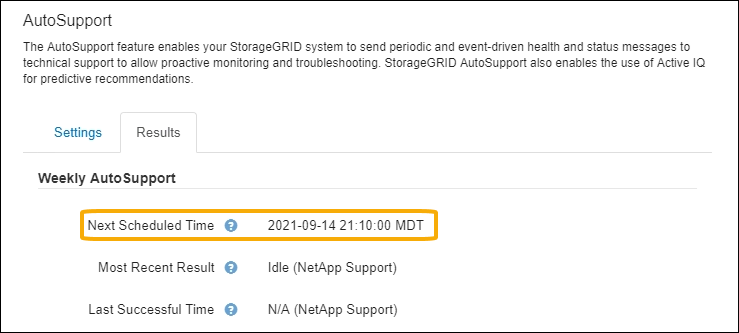

= AutoSupport を設定します
:allow-uri-read: 
:icons: font
:imagesdir: ../media/

[role="lead"]
AutoSupport 機能および個々の AutoSupport オプションは、 StorageGRID の初回インストール時に有効にするか、あとから有効にすることができます。

.作業を開始する前に
* を使用して Grid Manager にサインインします link:../admin/web-browser-requirements.html["サポートされている Web ブラウザ"]。
* Root Access 権限またはその他の Grid 設定権限が必要です。
* AutoSupport メッセージの送信にHTTPSを使用する場合は、プライマリ管理ノードへのアウトバウンドインターネットアクセス（直接または）を設定しておきます link:configuring-admin-proxy-settings.html["プロキシサーバを使用する"] （インバウンド接続は必要ありません）。
* [HTTP] StorageGRID AutoSupport ページで[HTTP]が選択されている場合は、AutoSupport メッセージをHTTPSとして転送するようにプロキシサーバを設定しています。ネットアップのAutoSupport サーバはHTTPを使用して送信されたメッセージを拒否します。
+
link:configuring-admin-proxy-settings.html["管理プロキシの設定について"]。

* AutoSupport メッセージのプロトコルとして SMTP を使用する場合は、 SMTP メールサーバを設定しておきます。アラームの E メール通知には同じメールサーバ設定（従来のシステム）が使用されます。

== AutoSupport メッセージのプロトコルを指定します

AutoSupport メッセージの送信には、次のいずれかのプロトコルを使用できます。

* * HTTPS * ：これはデフォルトで、新規インストールに推奨される設定です。このプロトコルはポート443を使用します。状況 <<AutoSupport On Demand を有効にする,AutoSupport オンデマンド機能を有効にします>>の場合は、HTTPSを使用する必要があります。
* * HTTP *：[HTTP]を選択した場合は、AutoSupport メッセージをHTTPSとして転送するようにプロキシサーバーを設定する必要があります。ネットアップのAutoSupport サーバはHTTPを使用して送信されたメッセージを拒否します。このプロトコルはポート80を使用します。
* * SMTP * ： AutoSupport メッセージを E メールで送信する場合は、このオプションを使用します。SMTP を AutoSupport メッセージのプロトコルとして使用する場合は、レガシー電子メール設定ページ（ * サポート * > * アラーム（レガシー） * > * レガシー電子メール設定 * ）で SMTP メールサーバーを設定する必要があります。
+

NOTE: StorageGRID 11.2 より前のリリースでは、 SMTP が AutoSupport メッセージに使用できる唯一のプロトコルでした。以前のバージョンの StorageGRID をインストールしていた場合は、 SMTP がプロトコルとして選択されている可能性があります。

設定したプロトコルは、すべてのタイプの AutoSupport メッセージの送信に使用されます。

.手順
. [ * support * > * Tools * > * AutoSupport * ] を選択します。
+
AutoSupport ページが表示され、 * 設定 * タブが選択されます。

+
image::../media/autosupport_settings_tab.png[[ 設定 ] タブのある AutoSupport ページ selected.png]

. AutoSupport メッセージの送信に使用するプロトコルを選択します。
. 「 * HTTPS * 」を選択した場合、 TLS 証明書を使用してネットアップサポートサーバへの接続を保護するかどうかを選択します。
+
** * ネットアップサポート証明書を使用 * （デフォルト）：証明書の検証により、 AutoSupport メッセージの送信を確実に保護します。ネットアップサポート証明書は、 StorageGRID ソフトウェアとともにすでにインストールされています。
** * 証明書を検証しない * ：このオプションは、証明書に一時的な問題があるなど、証明書の検証を使用しない理由が十分な場合にのみ選択してください。

. [ 保存（ Save ） ] を選択します。
+
毎週、ユーザトリガー型、およびイベントトリガー型のすべてのメッセージが選択したプロトコルを使用して送信されます。

== 週次 AutoSupport メッセージを無効にします

デフォルトでは、 StorageGRID システムは週に 1 回ネットアップサポートに AutoSupport メッセージを送信するように設定されています。

週次 AutoSupport メッセージが送信されるタイミングを確認するには、 * AutoSupport * > * Results * タブに移動します。[ * Weekly AutoSupport * ] セクションで、 [ 次のスケジュール時間 ] の値を確認します。

週単位の AutoSupport メッセージの自動送信はいつでも無効にすることができます。

.手順
. [ * support * > * Tools * > * AutoSupport * ] を選択します。
. [毎週のAutoSupport を有効にする]*チェックボックスをオフにします。
. [ 保存（ Save ） ] を選択します。

== イベントトリガー型 AutoSupport メッセージを無効にします

デフォルトでは、 StorageGRID システムは、重要なアラートやその他の重大なシステムイベントが発生したときに AutoSupport メッセージをネットアップサポートに送信するように設定されています。

イベントトリガー型 AutoSupport メッセージはいつでも無効にすることができます。

.手順
. [ * support * > * Tools * > * AutoSupport * ] を選択します。
. [Enable Event-Triggered AutoSupport *]チェックボックスをオフにします。
. [ 保存（ Save ） ] を選択します。

== AutoSupport On Demand を有効にする

AutoSupport On Demand は、テクニカルサポートが問題解決に積極的に取り組んでいる場合に役立ちます。

デフォルトでは、 AutoSupport On Demand は無効になっています。この機能を有効にすると、テクニカルサポートは、 StorageGRID システムから AutoSupport メッセージを自動的に送信するよう要求できます。テクニカルサポートは、 AutoSupport On Demand クエリのポーリング間隔も設定できます。

テクニカルサポートは、AutoSupport On Demandを有効または無効にできません。

.手順
. [ * support * > * Tools * > * AutoSupport * ] を選択します。
. プロトコルの * HTTPS * を選択します。
. [毎週のAutoSupport を有効にする]*チェックボックスをオンにします。
. [Enable AutoSupport on Demand]*チェックボックスをオンにします。
. [ 保存（ Save ） ] を選択します。
+
AutoSupport On Demand は有効になっており、テクニカルサポートは AutoSupport On Demand 要求を StorageGRID に送信できます。

== ソフトウェアアップデートのチェックを無効にします

デフォルトでは、 StorageGRID はネットアップに連絡して、ご使用のシステムでソフトウェアの更新が利用可能かどうかを判断します。StorageGRID ホットフィックスまたは新しいバージョンが利用可能な場合は、 StorageGRID のアップグレードページに新しいバージョンが表示されます。

必要に応じて、ソフトウェアアップデートのチェックを無効にすることもできます。たとえば、 WAN でアクセスできないシステムの場合は、ダウンロードエラーを回避するためにチェックを無効にする必要があります。

.手順
. [ * support * > * Tools * > * AutoSupport * ] を選択します。
. [Check for software updates]*チェックボックスをオフにします。
. [ 保存（ Save ） ] を選択します。

== AutoSupport デスティネーションを追加します

AutoSupport を有効にすると、ヘルスメッセージとステータスメッセージがネットアップサポートに送信されます。すべての AutoSupport メッセージに対して、追加の送信先を 1 つ指定できます。

AutoSupport メッセージの送信に使用されるプロトコルを確認または変更するには、の手順を参照してください <<AutoSupport メッセージのプロトコルを指定します>>。

NOTE: SMTPプロトコルを使用してAutoSupport メッセージを追加の送信先に送信することはできません。

.手順
. [ * support * > * Tools * > * AutoSupport * ] を選択します。
. [Enable Additional AutoSupport Destination]*を選択します。
. 次の情報を指定します。
+
[cols="1a,2a"]
|===
| フィールド | 説明 

 a| 
ホスト名
 a| 
追加のAutoSupport 宛先サーバのサーバホスト名またはIPアドレス。

*注*：追加の目的地は1つだけ入力できます。

 a| 
ポート
 a| 
追加のAutoSupport 宛先サーバへの接続に使用するポート。デフォルトは、HTTPの場合はポート80、HTTPSの場合はポート443です。

 a| 
証明書の検証
 a| 
TLS証明書を使用して追加の送信先への接続を保護するかどうか。

** 証明書の検証なしでAutoSupport メッセージを送信するには、[証明書を検証しない]*を選択します。
+
このオプションは、証明書の検証を使用しない理由がある場合（証明書に一時的な問題がある場合など）にのみ選択してください。

** 証明書の検証を使用する場合は、*[カスタムCAバンドルを使用する]*を選択します。

|===
. [Use custom CA bundle]*を選択した場合は、次のいずれかを実行します。
+
** [ * 参照 * ] を選択し、証明書が含まれているファイルに移動し、 [ * 開く * ] を選択してファイルをアップロードします。
** 編集ツールを使用して、PEMでエンコードされた各CA証明書ファイルのすべての内容を、証明書チェーンの順序で連結された* CA Bundle *フィールドにコピーして貼り付けます。
+
を含める必要があります `----BEGIN CERTIFICATE----` および `----END CERTIFICATE----` を選択します。

+
image::../media/autosupport_certificate.png[AutoSupport 証明書]

. [ 保存（ Save ） ] を選択します。
+
それ以降に送信される毎週、イベントトリガー型、およびユーザトリガー型の AutoSupport メッセージは、すべて追加の送信先に送信されます。

