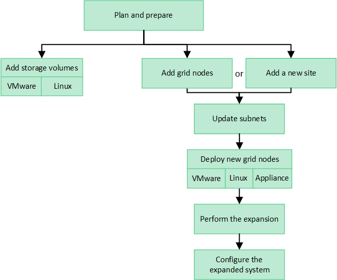

= グリッドを展開します。概要
:allow-uri-read: 
:icons: font
:imagesdir: ../media/

[role="lead"]
以下の手順に従って、システム処理を中断することなく StorageGRID システムの容量または機能を拡張します。

== これらの手順について

以下の手順では、 StorageGRID を拡張してストレージノードにストレージボリュームを追加する方法、既存のサイトに新しいグリッドノードを追加する方法、または新しいサイト全体を追加する方法について説明します。

ここで説明する手順は、 StorageGRID システムのインストール後に設定とサポートを担当する技術担当者を対象としています。

== 拡張ワークフロー

拡張を実施する理由によって、追加する必要がある各タイプの新しいノードの数と、追加する新しいノードの場所が決まります。たとえば、ストレージ容量の拡張、メタデータ容量の追加、冗長性や新機能の追加を行う場合、ノード要件は異なります。

ワークフローに示すように、拡張の手順は、ストレージノードにストレージボリュームを追加するか、既存のサイトに新しいノードを追加するか、新しいサイトを追加するかによって異なります。いずれの場合も、現在のシステムの処理を中断せずに拡張を実行できます。

ノードを追加する手順は、 StorageGRID アプライアンスを追加するか、 VMware または Linux を実行しているホストを追加するかによっても異なります。

NOTE: 「 Linux 」とは、 Red Hat ® Enterprise Linux ® 、 Ubuntu ® 、 CentOS 、または Debian ® の環境を指します。を使用します https://imt.netapp.com/matrix/#welcome["ネットアップの Interoperability Matrix Tool （ IMT ）"^] をクリックすると、サポートされるバージョンのリストが表示されます。

