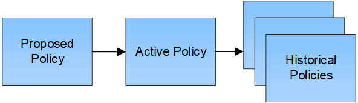

= ILMポリシーを作成します。Overview
:allow-uri-read: 
:icons: font
:imagesdir: ../media/

[role="lead"]
情報ライフサイクル管理（ ILM ）ポリシーは、優先順位が付けられた一連の ILM ルールです。 StorageGRID システムが時間の経過に伴ってオブジェクトデータを管理する方法を決定します。

ILM ポリシーを作成するには、最初に ILM ルールを選択して配置します。次に、以前に取り込まれたオブジェクトに対してドラフトポリシーをシミュレートし、その動作を確認します。ドラフトポリシーが意図したとおりに機能していることを確認したら、そのポリシーをアクティブ化してアクティブポリシーを作成できます。

CAUTION: ILM ポリシーが正しく設定されていないと、リカバリできないデータ損失が発生する可能性があります。ILM ポリシーをアクティブ化する前に、 ILM ポリシーおよびその ILM ルールを慎重に確認し、次に ILM ポリシーをシミュレートします。ILM ポリシーが意図したとおりに機能することを必ず確認してください。

== デフォルトのILMポリシー

StorageGRID をインストールしてサイトを追加すると、デフォルトのILMポリシーが自動的に作成されます。グリッドにサイトが1つある場合、デフォルトのポリシーには、そのサイトの各オブジェクトのコピーを2つレプリケートするデフォルトルールが含まれています。グリッドに複数のサイトが含まれている場合、デフォルトルールは各サイトに各オブジェクトのコピーを1つレプリケートします。

デフォルトのポリシーがストレージ要件を満たしていない場合は、独自のルールとポリシーを作成できます。を参照してください link:what-ilm-rule-is.html["ILM ルールとは"] および link:creating-proposed-ilm-policy.html["ドラフトのILMポリシーを作成します"]。

== ILM ポリシーによるオブジェクトの評価方法

StorageGRID システムのアクティブな ILM ポリシーは、すべてのオブジェクトの配置、期間、データ保護を制御します。

クライアントがオブジェクトを StorageGRID に保存すると、オブジェクトはアクティブポリシー内の順序付けられた ILM ルールに照らして次のように評価されます。

. ポリシー内の最初のルールのフィルタがオブジェクトに一致すると、オブジェクトはそのルールの取り込み動作に従って取り込まれ、そのルールの配置手順に従って格納されます。
. 最初のルールのフィルタがオブジェクトに一致しない場合、オブジェクトはポリシー内の後続の各ルールに照らして（一致するまで）評価されます。
. どのルールもオブジェクトに一致しない場合は、ポリシー内のデフォルトルールの取り込み動作と配置手順が適用されます。デフォルトルールは、ポリシー内の最後のルールです。デフォルトルールは、すべてのテナント、すべてのバケット、およびすべてのオブジェクトバージョンに適用する必要があり、高度なフィルタは使用できません。

== ILM ポリシーの例

たとえば、ILMポリシーに次の情報を指定する3つのILMルールを含めることができます。

* *ルール1：テナントAのレプリケートコピー*
+
** テナントAに属するすべてのオブジェクトを一致します
** これらのオブジェクトを3つのサイトに3つのレプリケートコピーとして格納します。
** 他のテナントに属するオブジェクトはルール1に一致しないため、ルール2に照らして評価されます。

* *ルール2：1MBを超えるオブジェクトのイレイジャーコーディング*
+
** 他のテナントのすべてのオブジェクトが一致します（1MBを超える場合にのみ一致します）。これらのオブジェクトは、 3 つのサイトで 6+3 のイレイジャーコーディングを使用して格納されます。
** は1MB以下のオブジェクトに一致しないため、これらのオブジェクトはルール3に照らして評価されます。

* *ルール3：2つのデータセンターに2つのコピーを作成*（デフォルト）
+
** は、ポリシー内の最後のデフォルトルールです。フィルタを使用しません。
** ルール1またはルール2に一致しないすべてのオブジェクト（テナントAに属していない1MB以下のオブジェクト）のレプリケートコピーを2つ作成します。

image::../media/ilm_policy_and_rules.png[ILM のポリシーとルール]

== ドラフトポリシー、アクティブポリシー、履歴ポリシーとは何ですか？

各 StorageGRID システムには、アクティブな ILM ポリシーが 1 つ必要です。StorageGRID システムでは、ドラフトの ILM ポリシーを 1 つと任意の数の履歴ポリシーを使用できます。

初めて ILM ポリシーを作成するときは、 ILM ルールを 1 つ以上選択して特定の順序で並べ、ドラフトポリシーを作成します。ドラフトポリシーをシミュレートして動作を確認したら、そのポリシーをアクティブ化してアクティブポリシーを作成します。

新しい ILM ポリシーをアクティブ StorageGRID 化すると、そのポリシーを使用して、既存のオブジェクトと新たに取り込まれたオブジェクトを含むすべてのオブジェクトが管理されます。新しいポリシーの ILM ルールが実装されたときに、既存のオブジェクトが新しい場所に移動されることがあります。

ドラフトポリシーをアクティブ化すると、それまでのアクティブポリシーは履歴ポリシーになります。ILM履歴ポリシーは削除できません。

== ILM ポリシーの作成に関する考慮事項

* システム提供のポリシーであるBaseline 2 Copiesポリシーは、テストシステムでのみ使用してください。StorageGRID 11.6以前の場合、このポリシーのMake 2 Copiesルールでは、すべてのサイトが含まれるAll Storage Nodesストレージプールを使用します。StorageGRID システムに複数のサイトがある場合は、 1 つのオブジェクトのコピーが同じサイトに 2 つ配置される可能性があります。
+

NOTE: All Storage Nodesストレージプールは、StorageGRID 11.6以前のインストール時に自動的に作成されます。新しいバージョンのStorageGRID にアップグレードしても、All Storage Nodesプールは引き続き存在します。StorageGRID 11.7以降を新規インストールとしてインストールする場合、All Storage Nodesプールは作成されません。

* 新しいポリシーを設計する際には、グリッドに取り込まれる可能性のあるさまざまなタイプのオブジェクトをすべて考慮してください。それらのオブジェクトに一致し、必要に応じて配置するルールがポリシーに含まれていることを確認してください。
* ILM ポリシーはできるだけシンプルにします。これにより、時間が経って StorageGRID システムに変更が加えられ、オブジェクトデータが意図したとおりに保護されないという危険な状況を回避できます。
* ポリシー内のルールの順序が正しいことを確認してください。ポリシーをアクティブ化すると、新規および既存のオブジェクトがリスト内の順にルールによって評価されます。たとえば、ポリシー内の最初のルールがオブジェクトに一致した場合、そのオブジェクトは他のルールによって評価されません。
* すべてのILMポリシーの最後のルールはデフォルトのILMルールであり、フィルタは使用できません。オブジェクトが別のルールに一致していない場合は、デフォルトルールによって、そのオブジェクトの配置場所と保持期間が制御されます。
* 新しいポリシーをアクティブ化する前に、ポリシーによって既存のオブジェクトの配置が変更されていないかどうかを確認します。既存のオブジェクトの場所を変更すると、新しい配置が評価されて実装される際に一時的なリソースの問題が発生する可能性があります。

