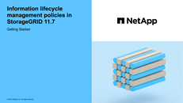

= ILM によるオブジェクトの管理：概要
:allow-uri-read: 
:icons: font
:imagesdir: ../media/

[role="lead"]
StorageGRID システム内のオブジェクトを管理するには、1つ以上のILMルールで構成される情報ライフサイクル管理（ILM）ポリシーを設定します。ILMルールは、オブジェクトデータのコピーを作成および分散する方法と、それらのコピーを一定の期間にわたって管理する方法をStorageGRID に指示します。

== これらの手順について

ILM ルールと ILM ポリシーを設計して実装するには、慎重な計画が必要です。運用要件、 StorageGRID システムのトポロジ、オブジェクト保護のニーズ、使用可能なストレージタイプについて理解しておく必要があります。次に、さまざまなタイプのオブジェクトをどのようにコピー、分散、および格納するかを決定する必要があります。

次の手順に従って、次の操作を行います

* を含むStorageGRID ILMについて説明します link:how-ilm-operates-throughout-objects-life.html["オブジェクトのライフサイクル全体にわたるILMの動作"]。
* 設定方法については、こちらをご覧ください link:what-storage-pool-is.html["ストレージプール"]、 link:what-cloud-storage-pool-is.html["クラウドストレージプール"]および link:what-ilm-rule-is.html["ILM ルール"]。
* 方法をご確認ください link:creating-proposed-ilm-policy.html["ILMポリシーを作成、シミュレート、アクティブ化します"] 1つ以上のサイトにまたがるオブジェクトデータを保護します。
* 方法をご確認ください link:managing-objects-with-s3-object-lock.html["S3オブジェクトロックを使用してオブジェクトを管理します"]これは、特定のS3バケット内のオブジェクトが指定した期間削除または上書きされないようにするのに役立ちます。

== 詳細はこちら。

詳細については、次のビデオをご覧ください。

* https://netapp.hosted.panopto.com/Panopto/Pages/Viewer.aspx?id=6baa2e69-95b7-4bcf-a0ff-afbd0092231c["ビデオ：StorageGRID 11.7の情報ライフサイクル管理ルール"^]。
+
[link=https://netapp.hosted.panopto.com/Panopto/Pages/Viewer.aspx?id=6baa2e69-95b7-4bcf-a0ff-afbd0092231c]
image::../media/video-screenshot-ilm-rules-117.png[ビデオ：StorageGRID 11.7の情報ライフサイクル管理ルール]

* https://netapp.hosted.panopto.com/Panopto/Pages/Viewer.aspx?id=0009ebe1-3665-4cdc-a101-afbd009a0466["ビデオ：StorageGRID 11.7の情報ライフサイクル管理ポリシー"^]
+
[link=https://netapp.hosted.panopto.com/Panopto/Pages/Viewer.aspx?id=0009ebe1-3665-4cdc-a101-afbd009a0466]

