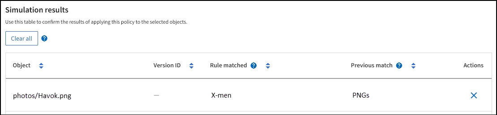

= ILM ポリシーをシミュレートします
:allow-uri-read: 
:icons: font
:imagesdir: ../media/

[role="lead"]
ポリシーをアクティブ化して本番環境のデータに適用する前に、テストオブジェクトでドラフトポリシーをシミュレートします。シミュレーション期間は、アクティブ化して本番環境のデータに適用する前にポリシーを安全にテストするための、スタンドアロン環境を提供します。

.作業を開始する前に
* を使用して Grid Manager にサインインします link:../admin/web-browser-requirements.html["サポートされている Web ブラウザ"]。
* を使用することができます link:../admin/admin-group-permissions.html["必要なアクセス権限"]。
* テストする各オブジェクトのS3バケット/オブジェクトキーまたはSwiftコンテナ/オブジェクト名を確認しておきます。

.このタスクについて
ドラフトポリシーでテストするオブジェクトを慎重に選択します。ポリシーを確実にシミュレートするには、各ルールのフィルタごとに少なくとも 1 つのオブジェクトをテストする必要があります。

たとえば、バケット A のオブジェクトに一致するルールとバケット B のオブジェクトに一致するルールを含むポリシーを確実にテストするためには、少なくともバケット A から 1 つとバケット B から 1 つオブジェクトを選択する必要があります。デフォルトルールをテストするには、別のバケットから少なくとも 1 つのオブジェクトを選択する必要もあります。

ポリシーをシミュレートする場合は、次の点を考慮します。

* ポリシーを変更したら、ドラフトポリシーを保存します。次に、保存したドラフトポリシーの動作をシミュレートします。
* ポリシーをシミュレートするとポリシー内の ILM ルールがテストオブジェクトをフィルタリングするため、各オブジェクトにどのルールが適用されたかを確認できます。ただし、オブジェクトのコピーは作成されず、配置もされません。シミュレーションを実行しても、データ、ルール、ポリシーはいっさい変更されません。
* [ドラフトポリシーをシミュレート]ウィンドウでは、*[すべてクリア]*または[削除]アイコンを選択するまで、テストしたオブジェクトは保持されます image:../media/icon-x-to-remove.png["削除アイコン"] [シミュレーション結果（Simulation results）]リストの各オブジェクトについて。
* シミュレーションは、一致したルールの名前を返します。有効なストレージプールまたはイレイジャーコーディングプロファイルを確認するには、ルールの名前を選択してルールの詳細ページに移動します。このページでは、保持図やルールに関するその他の詳細を確認できます。
* S3のバージョン管理が有効になっている場合は、シミュレーションに使用するオブジェクトのバージョンIDを入力できます。

.手順
. link:creating-proposed-ilm-policy.html["ドラフトポリシーを作成"]。
. S3 / Swift クライアントまたはを使用する link:../tenant/use-s3-console.html["Experimental S3 Console の略"]テナントごとに Tenant Manager で使用できるように、各ルールのテストに必要なオブジェクトを取り込みます。
. [ILM policy]ページの[Proposed policy]タブで、*[Simulate]*を選択します。
. [* Object *]フィールドにS3と入力します `bucket/object-key` またはSwift `container/object-name` テストオブジェクトの場合。例： `bucket-01/filename.png`。
. 必要に応じて、* Version ID *フィールドにオブジェクトのバージョンIDを入力します。
. 「 * Simulate * 」を選択します。
. [Simulation results]セクションで、各オブジェクトが正しいルールに一致したことを確認します。

== 例 1 ：ドラフトの ILM ポリシーをシミュレートしてルールを確認する

この例では、ドラフトポリシーをシミュレートするときにルールを検証する方法について説明します。

この例では、 2 つのバケットに取り込まれたオブジェクトに対して * サンプルの ILM ポリシー * をシミュレートします。このポリシーには、次の 3 つのルールが含まれています。

* 最初のルール「 * 2 copies 、 buckets-a * 」の 2 年間は、 bucket-a のオブジェクトにのみ適用されます
* 2 番目のルール「 * EC objects > 1 MB * 、環境 all buckets] は 1MB を超えるオブジェクトをフィルタリングします。
* 3 つ目のルール「 * 2 つのコピー、 2 つのデータセンター」はデフォルトルールです。フィルタは含まれず、参照時間を noncurrent に指定したものは使用しません。

ポリシーをシミュレートしたら、各オブジェクトが正しいルールに一致したことを確認します。

image::../media/simulate_policy_screen.png[ポリシーの結果をシミュレートします]

次の例では、

* `bucket-a/bucket-a object.pdf` のオブジェクトをフィルタリングする最初のルールを正しくマッチングしました `bucket-a`。
* `bucket-b/test object greater than 1 MB.pdf` がにあります `bucket-b`では、最初のルールと一致しませんでした。代わりに、 1MB を超えるオブジェクトをフィルタリングする 2 つ目のルールに正しく一致しました。
* `bucket-b/test object less than 1 MB.pdf` 最初の2つのルールのフィルタに一致しなかったため、フィルタが含まれていないデフォルトルールによって配置されます。

== 例 2 ：ドラフトの ILM ポリシーをシミュレートする際にルールの順序を変更する

この例では、ポリシーをシミュレートする際に、ルールの順序を変更して結果を変更する方法を示します。

この例では、 * Demo * ポリシーをシミュレートします。このポリシーの目的は次の 3 つのルールで、 series = x -men ユーザメタデータを含むオブジェクトを検索することです。

* 最初のルール「* PNGs *」はで終わるキー名に対してフィルタを適用します `.png`。
* 2つ目のルール「* X-men」はテナントAのオブジェクトにのみ適用され、フィルタを適用します `series=x-men` ユーザメタデータ。
* 最後のルール「* two copies two data centers *」がデフォルトルールで、最初の2つのルールに一致しないオブジェクトに一致します。

.手順
. ルールを追加してポリシーを保存したら、 * Simulate * を選択します。
. * Object * フィールドに、テストオブジェクトの S3 バケット / オブジェクトキーまたは Swift コンテナ / オブジェクト名を入力し、 * Simulate * を選択します。
+
シミュレーション結果が表示され、が示されます `Havok.png` オブジェクトは「* PNGs *」ルールに一致しました。

+
image::../media/simulate_reorder_rules_pngs_result.png[例 2 ：ドラフトの ILM ポリシーをシミュレートする際にルールの順序を変更する]

+
ただし、 `Havok.png` は、* X-men *ルールをテストするためのものです。

. 問題 を解決するには、ルールの順序を変更します。
+
.. [Finish]*を選択して[Simulate ILM Policy]ウィンドウを閉じます。
.. ポリシーを編集するには、*[アクション]*>*[編集]*を選択します。
.. 「 * X-men 」ルールをリストの先頭にドラッグします。
.. [ 保存（ Save ） ] を選択します。

. 「 * Simulate * 」を選択します。
+
以前にテストしたオブジェクトが更新したポリシーに照らして再評価され、新しいシミュレーション結果が表示されます。この例では、Rule Matchedカラムにが表示されています `Havok.png` 想定どおりに「X-men」メタデータルールに一致します。[Previous Match]列には、PNGsルールが前回のシミュレーションでオブジェクトに一致したことが表示されます。

+

+

NOTE: [Proposed Policy]タブのままであれば、変更後にテストオブジェクトの名前を再入力せずにポリシーを再シミュレートできます。

== 例 3 ：ドラフトの ILM ポリシーをシミュレートしてルールを修正する

この例では、ポリシーをシミュレートしてポリシー内のルールを修正し、シミュレーションを続行する方法を示します。

この例では、 * Demo * ポリシーをシミュレートします。このポリシーの目的は、が含まれるオブジェクトを検索することです `series=x-men` ユーザメタデータ。ただし、に対してシミュレートしたところ予期しない結果が発生しました `Beast.jpg` オブジェクト。オブジェクトが「 X-men 」メタデータルールではなくデフォルトルールに一致しましたが、 2 つのデータセンターがコピーされています。

image::../media/simulate_results_for_object_wrong_metadata.png[例 3 ：ドラフトの ILM ポリシーをシミュレートする際にルールを修正する]

テストオブジェクトがポリシー内の想定したルールに一致しない場合は、ポリシー内の各ルールを調べてエラーを修正する必要があります。

.手順
. [完了]*を選択して[ポリシーのシミュレート]ダイアログを閉じます。[ドラフトポリシー]タブで、*[保持図]*を選択します。次に、必要に応じて各ルールの*[すべて展開]*または*[詳細を表示]*を選択します。
. ルールのテナントアカウント、参照時間、およびフィルタ条件を確認します。
+
たとえば、「X-men」ルールのメタデータが「`x-men01`」ではなく「`x-men01`」と入力されたとします。

. エラーを解決するには、次のようにルールを修正します。
+
** ルールがドラフトポリシーに含まれている場合は、ルールをクローニングするか、ポリシーから削除してポリシーを編集できます。
** ルールがアクティブポリシーに含まれている場合は、ルールをクローニングする必要があります。アクティブポリシーのルールを編集したり削除したりすることはできません。
+
[cols="1a,3a"]
|===
| オプション | 手順 

 a| 
ルールのクローンを作成します
 a| 
... [* ILM*>* Rules] を選択します。
... 不正なルールを選択し、 * Clone * を選択します。
... 新しいルールの名前を入力し、誤った情報を変更して*[作成]*を選択します。
... [ILM]*>*[Policies]*>*ドラフトポリシー*を選択します。
... [アクション]*>*[編集]*を選択します。
... [ルールの選択]*を選択し、*[続行]*を選択して同じデフォルトルールを使用します。
... [他のルールを選択]ステップで、新しいルールのチェックボックスをオンにし、元のルールのチェックボックスをオフにして*[選択]*を選択します。
... 必要に応じて、新しいルールを正しい場所にドラッグしてルールの順序を変更します。
... [ 保存（ Save ） ] を選択します。

 a| 
ルールを編集します
 a| 
... ILM *>* Policies *>* Proposed policy *を選択し、編集するルールを削除します。
... [* ILM*>* Rules] を選択します。
... 編集するルールを選択し、*[編集]*を選択します。または、ルールのチェックボックスを選択して*[アクション]*>*[編集]*を選択します。
... ウィザードの各部分について誤った情報を変更し、*[更新]*を選択します。
... [ILM]*>*[Policies]*>*ドラフトポリシー*を選択します。
... [アクション]*>*[編集]*を選択します。
... [ルールの選択]*を選択し、*[続行]*を選択して同じデフォルトルールを使用します。
... [他のルールを選択]ダイアログボックスで、修正したルールのチェックボックスを選択して*[選択]*を選択し、*[保存]*を選択します。
... デフォルト以外のルールの行をドラッグして、これらのルールを評価する順序を決定します。

|===

. もう一度シミュレーションを実行します。
+
この例では、修正した「X-men」ルールがに一致します `Beast.jpg` に基づくオブジェクト `series=x-men` ユーザメタデータ（期待どおり）。

+
image::../media/simulate_results_for_object_corrected_metadata.png[例 3 ：ドラフトの ILM ポリシーをシミュレートする際にルールを修正する]

