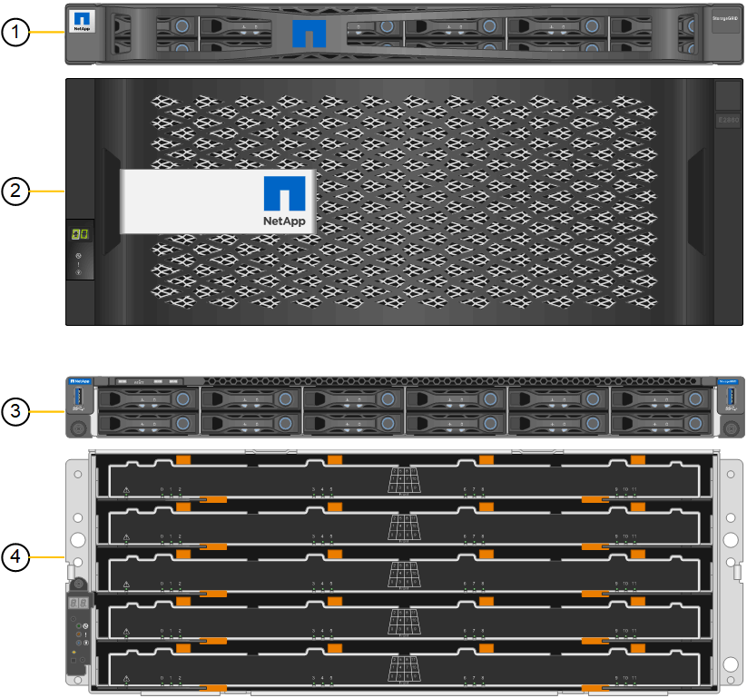

= SG6060およびSG6060Xアプライアンス：概要
:allow-uri-read: 
:icons: font
:imagesdir: ../media/

[role="lead"]
StorageGRID SG6060とSG6060Xアプライアンスには、それぞれコンピューティングコントローラと、2台のストレージコントローラと60本のドライブを搭載したストレージコントローラシェルフが搭載されています。

必要に応じて、60ドライブ拡張シェルフを両方のアプライアンスに追加できます。ストレージコントローラのインターコネクトポートの位置以外に、SG6060とSG6060Xには仕様や機能の違いはありません。

== SG6060とSG6060Xのコンポーネント

SG6060およびSG6060Xアプライアンスには、次のコンポーネントが含まれています。

[cols="1a,2a"]
|===
| コンポーネント | 説明 

 a| 
コンピューティングコントローラ
 a| 
SG6000-CN コントローラ、 1 ラックユニット（ 1U ）サーバ。次のものが搭載されています。

* 40 コア（ 80 スレッド）
* 192GB の RAM
* 25Gbps アグリゲートイーサネット帯域幅 × 最大 4
* 16Gbps Fibre Channel （ FC ）インターコネクト × 4
* ベースボード管理コントローラ（ BMC ） - ハードウェア管理を簡素化します
* 冗長電源装置

 a| 
ストレージコントローラシェルフ
 a| 
E シリーズ E2860 コントローラシェルフ（ストレージアレイ）。 4U シェルフの 1 つで、構成は次のとおりです。

* E2800シリーズのコントローラ×2（デュプレックス構成）-ストレージコントローラのフェイルオーバーをサポートします
+
** E2800Aストレージコントローラが搭載されます
** SG6060Xには、E2800Bのストレージコントローラが含まれています

* 5 ドロワードライブシェルフ - 3.5 インチドライブを 60 本（ SSD × 2 、 NL-SAS ドライブ × 58 ）収容
* 冗長電源装置とファン

 a| 
オプション：ストレージ拡張シェルフ

* 注：拡張シェルフは、初期導入時に設置することも、あとで追加することもできます。
 a| 
E シリーズ DE460C エンクロージャ： 4U シェルフで、以下を構成：

* 入出力モジュール（ IOM ） × 2
* それぞれに 12 本の NL-SAS ドライブを搭載し、合計 60 本のドライブを搭載したドロワー × 5
* 冗長電源装置とファン

各SG6060およびSG6060Xアプライアンスには拡張シェルフを1台または2台搭載して合計180本のドライブを搭載できます（そのうち2本はEシリーズの読み取りキャッシュ用に予約されています）。

|===

== SG6060およびSG6060Xの図

SG6060とSG6060Xの前面は同じです。

=== SG6060またはSG6060Xの前面

次の図は、SG6060またはSG6060Xの前面です。1Uコンピューティングコントローラ1台、2台のストレージコントローラと5台のドライブドロワーに60本のドライブを搭載した4Uシェルフ1台で構成されます。

[cols="1a,2a"]
|===
| コールアウト | 説明 

 a| 
1.
 a| 
前面ベゼルを取り付けた SG6000-CN コンピューティングコントローラ

 a| 
2.
 a| 
前面ベゼルを取り付けた E2860 コントローラシェルフ（オプションの拡張シェルフも同様）

 a| 
3.
 a| 
前面ベゼルを取り外した SG6000-CN のコンピューティングコントローラ

 a| 
4.
 a| 
前面ベゼルを取り外した E2860 コントローラシェルフ（オプションの拡張シェルフも同様）

|===

=== SG6060の背面

この図は、コンピューティングコントローラ、ストレージコントローラ、ファン、電源装置を含む SG6060 の背面を示しています。

image::../media/sg6060_rear_view.gif[SG6060 の背面図]

[cols="1a,2a"]
|===
| コールアウト | 説明 

 a| 
1.
 a| 
SG6000-CN コンピューティングコントローラの電源装置（ × 2 ）

 a| 
2.
 a| 
SG6000-CN コンピューティングコントローラのコネクタ

 a| 
3.
 a| 
E2860 コントローラシェルフのファン（ × 2 ）

 a| 
4.
 a| 
EシリーズE2800Aストレージコントローラ（×2）とコネクタ

 a| 
5.
 a| 
E2860 コントローラシェルフの電源装置（ × 2 ）

|===

=== SG6060Xの背面

次の図は、SG6060Xの背面を示しています。

image::../media/sg6060x_rear_view.gif[SG6060xの背面図]

[cols="1a,2a"]
|===
| コールアウト | 説明 

 a| 
1.
 a| 
SG6000-CN コンピューティングコントローラの電源装置（ × 2 ）

 a| 
2.
 a| 
SG6000-CN コンピューティングコントローラのコネクタ

 a| 
3.
 a| 
E2860 コントローラシェルフのファン（ × 2 ）

 a| 
4.
 a| 
EシリーズE2800Bストレージコントローラ（×2）とコネクタ

 a| 
5.
 a| 
E2860 コントローラシェルフの電源装置（ × 2 ）

|===

=== 拡張シェルフ

この図は、SG6060とSG6060Xのオプションの拡張シェルフの背面です。これには、入出力モジュール（IOM）、ファン、電源装置が含まれます。各 SG6060 には、初期設置に含めることもあとで追加することもできる拡張シェルフを 1 台または 2 台設置することもできます。

image::../media/de460c_expansion_shelf_rear_view.gif[拡張シェルフの背面]

[cols="1a,2a"]
|===
| コールアウト | 説明 

 a| 
1.
 a| 
拡張シェルフのファン（ × 2 ）

 a| 
2.
 a| 
拡張シェルフの IOM （ × 2 ）

 a| 
3.
 a| 
拡張シェルフの電源装置（ × 2 ）

|===