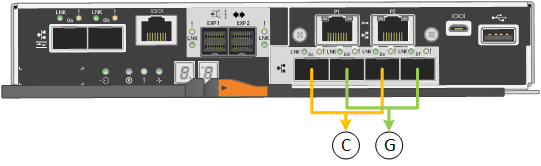

= ポートボンディングモード（E5700SGコントローラ）
:allow-uri-read: 
:icons: font
:imagesdir: ../media/

[role="lead"]
いつ link:configuring-network-links.html["ネットワークリンクを設定しています"] E5700SGコントローラでは、グリッドネットワークとオプションのクライアントネットワークに接続する10 / 25GbEポート、およびオプションの管理ネットワークに接続する1GbE管理ポートに対してポートボンディングを使用できます。ポートボンディングを使用すると、 StorageGRID ネットワークとアプライアンスの間のパスが冗長化されるため、データの保護に役立ちます。

== 10 / 25GbE ポートのネットワークボンディングモード

E5700SG コントローラの 10 / 25GbE ネットワークポートは、グリッドネットワークおよびクライアントネットワーク接続用に、 Fixed または Aggregate のポートボンディングモードをサポートしています。

=== Fixed ポートボンディングモード

固定モードは、 10 / 25GbE ネットワークポートのデフォルトの設定です。

[cols="1a,3a"]
|===
| コールアウト | ボンディングされるポート 

 a| 
C
 a| 
このネットワークを使用する場合、ポート 1 とポート 3 がクライアントネットワーク用にボンディングされます。

 a| 
G
 a| 
ポート 2 とポート 4 がグリッドネットワーク用にボンディングされます。

|===
Fixed ポートボンディングモードを使用する場合は、 Active-Backup または Link Aggregation Control Protocol （ LACP ）のいずれかのネットワークボンディングモードを使用できます。

* Active-Backup モード（デフォルト）では、一度に 1 つのポートのみがアクティブになります。アクティブポートで障害が発生すると、バックアップポートが自動的にフェイルオーバーして接続が継続されます。ポート 4 がポート 2 のバックアップパスとなり（グリッドネットワーク）、ポート 3 がポート 1 のバックアップパスとなります（クライアントネットワーク）。
* LACP モードでは、各ポートペアでコントローラとネットワークの間の論理チャネルが形成され、スループットが向上します。一方のポートで障害が発生しても、もう一方のポートは引き続きチャネルを提供します。スループットは低下しますが、接続に影響はありません。

NOTE: 冗長接続が必要ない場合は、ネットワークごとに1つのポートのみを使用できます。ただし、 StorageGRID をインストールしたあとにグリッドマネージャでアラームが生成され、ケーブルが取り外されていることが通知されます。このアラームは確認後に解除してかまいません。

=== Aggregate ポートボンディングモード

アグリゲートポートボンディングモードを使用すると、各 StorageGRID ネットワークのスループットが大幅に向上し、追加のフェイルオーバーパスも確保されます。

image::../media/e5700sg_aggregate_port.gif[Aggregate ポートボンディングモードで使用されるポートを指定します]

[cols="1a,3a"]
|===
| コールアウト | ボンディングされるポート 

 a| 
1.
 a| 
接続されたすべてのポートを 1 つの LACP ボンドにグループ化して、すべてのポートをグリッドネットワークとクライアントネットワークのトラフィックに使用できるようにします。

|===
Aggregate ポートボンディングモードを使用する場合は、次の点に注意してください。

* LACP ネットワークボンディングモードを使用する必要があります。
* 各ネットワークに一意の VLAN タグを指定する必要があります。この VLAN タグが各ネットワークパケットに追加され、ネットワークトラフィックが正しいネットワークにルーティングされます。
* VLAN と LACP をサポートするスイッチにポートを接続する必要があります。複数のスイッチを LACP ボンドに加える場合は、対象のスイッチが Multi-Chassis Link Aggregation （ MLAG ）グループまたは同等の機能をサポートしていることが必要です。
* VLAN、LACP、MLAGなどを使用するようにスイッチを設定する方法を理解しておく必要があります。

4つの10 / 25GbEポートをすべて使用する必要がない場合は、1つ、2つ、または3つのポートを使用できます。複数のポートを使用すると、 10 / 25GbE ポートの 1 つに障害が発生した場合でも、ネットワーク接続を確保できる可能性が高くなります。

NOTE: 4 つのポート全部を使用しない場合は、 StorageGRID をインストールしたあとにケーブルが取り外されていることを通知するアラームがグリッドマネージャで生成されるので注意してください。このアラームは確認後に解除してかまいません。

== 1GbE 管理ポートのネットワークボンディングモード

E5700SG コントローラの 2 つの 1GbE 管理ポートでは、 Independent ネットワークボンディングモードまたは Active-Backup ネットワークボンディングモードを選択してオプションの管理ネットワークに接続できます。

Independent モードでは、管理ポート 1 だけが管理ネットワークに接続されます。このモードではパスは冗長化されません。管理ポート 2 は、一時的なローカル接続（ IP アドレス 169.254.0.1 ）用に確保されます。

Active-Backup モードでは、管理ポート 1 と 2 の両方が管理ネットワークに接続されます。一度に 1 つのポートのみがアクティブになります。アクティブポートで障害が発生すると、バックアップポートが自動的にフェイルオーバーして接続が継続されます。これら 2 つの物理ポートを 1 つの論理管理ポートにボンディングすることで、管理ネットワークへのパスが冗長化されます。

NOTE: 1GbE 管理ポートが Active-Backup モードに設定されている場合に E5700SG コントローラへの一時的なローカル接続が必要な場合は、両方の管理ポートからケーブルを取り外し、一時的なケーブルを管理ポート 2 に接続し、 IP アドレス 169.254.0.1 を使用してアプライアンスにアクセスしてください。

image::../media/e5700sg_bonded_management_ports.gif[E5700SG のボンディングされた管理ポート]
