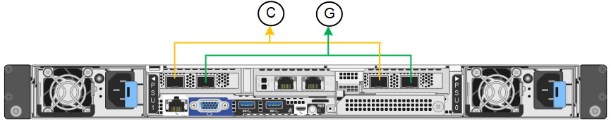
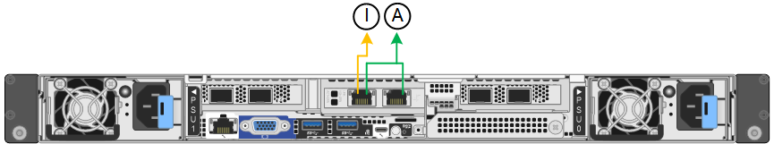

= ポートボンディングモード（SGF6112）
:allow-uri-read: 
:icons: font
:imagesdir: ../media/

[role="lead"]
いつ link:configuring-network-links.html["ネットワークリンクを設定しています"] SGF6112アプライアンスの場合は、グリッドネットワークとオプションのクライアントネットワークに接続するポート、およびオプションの管理ネットワークに接続する1 / 10GbE管理ポートに対してポートボンディングを使用できます。ポートボンディングを使用すると、 StorageGRID ネットワークとアプライアンスの間のパスが冗長化されるため、データの保護に役立ちます。

== ネットワークボンディングモード

アプライアンスのネットワークポートは、グリッドネットワークおよびクライアントネットワーク接続用に、FixedまたはAggregateのポートボンディングモードをサポートします。

=== Fixed ポートボンディングモード

Fixed ポートボンディングモードは、ネットワークポートのデフォルトの設定です。

[cols="1a,3a"]
|===
| コールアウト | ボンディングされるポート 

 a| 
C
 a| 
このネットワークを使用する場合、ポート 1 とポート 3 がクライアントネットワーク用にボンディングされます。

 a| 
G
 a| 
ポート 2 とポート 4 がグリッドネットワーク用にボンディングされます。

|===
Fixed ポートボンディングモードを使用する場合は、 Active-Backup モードまたは Link Aggregation Control Protocol （ LACP ）（ 802.3ad ）モードを使用してポートをボンディングできます。

* Active-Backup モード（デフォルト）では、一度に 1 つのポートのみがアクティブになります。アクティブポートで障害が発生すると、バックアップポートが自動的にフェイルオーバーして接続が継続されます。ポート 4 がポート 2 のバックアップパスとなり（グリッドネットワーク）、ポート 3 がポート 1 のバックアップパスとなります（クライアントネットワーク）。
* LACPモードでは、各ポートペアがアプライアンスとネットワークの間の論理チャネルを形成し、スループットを向上させます。一方のポートで障害が発生しても、もう一方のポートは引き続きチャネルを提供します。スループットは低下しますが、接続に影響はありません。

NOTE: 冗長接続が必要ない場合は、ネットワークごとに1つのポートのみを使用できます。ただし、StorageGRID のインストール後にケーブルが取り外されていることを示す* Storage appliance link down *アラートがGrid Managerでトリガーされることがあります。このアラートルールは安全に無効にすることができます。

=== Aggregate ポートボンディングモード

アグリゲートポートボンディングモードを使用すると、各 StorageGRID ネットワークのスループットが大幅に向上し、追加のフェイルオーバーパスも確保されます。

image::../media/sgf6112_aggregate_ports.png[SGF6100のアグリゲートポートボンディングモード]

[cols="1a,3a"]
|===
| コールアウト | ボンディングされるポート 

 a| 
1.
 a| 
接続されたすべてのポートを 1 つの LACP ボンドにグループ化して、すべてのポートをグリッドネットワークとクライアントネットワークのトラフィックに使用できるようにします。

|===
アグリゲートポートボンディングモードを使用する場合は、次の点に注意してください。

* LACP ネットワークボンディングモードを使用する必要があります。
* 各ネットワークに一意の VLAN タグを指定する必要があります。この VLAN タグが各ネットワークパケットに追加され、ネットワークトラフィックが正しいネットワークにルーティングされます。
* VLAN と LACP をサポートするスイッチにポートを接続する必要があります。複数のスイッチを LACP ボンドに加える場合は、対象のスイッチが Multi-Chassis Link Aggregation （ MLAG ）グループまたは同等の機能をサポートしていることが必要です。
* VLAN、LACP、MLAGなどを使用するようにスイッチを設定する方法を理解しておく必要があります。

4つのポートをすべて使用しない場合は、1つ、2つ、または3つのポートを使用できます。複数のポートを使用すると、ポートの 1 つに障害が発生した場合でも、ネットワーク接続を確保できる可能性が高くなります。

NOTE: ネットワークポートを 4 つ未満にすると、アプライアンスノードをインストールしたあとに、ケーブルが取り外されていることを示す * サービスアプライアンスリンク停止 * アラートが Grid Manager でトリガーされる場合があることに注意してください。トリガーされたアラートに対してこのアラートルールを安全に無効にすることができます。

== 管理ポートのネットワークボンディングモード

2つの1 / 10GbE管理ポートでは、オプションの管理ネットワークに接続するためのネットワークボンディングモードとして、[Independent]または[Active-Backup]を選択できます。

Independent モードでは、左側の管理ポートだけが管理ネットワークに接続されます。このモードではパスは冗長化されません。右側の管理ポートは接続されておらず、一時的なローカル接続（IPアドレス169.254.0.1を使用）に使用できます。

Active-Backup モードでは、両方の管理ポートが管理ネットワークに接続されます。一度に 1 つのポートのみがアクティブになります。アクティブポートで障害が発生すると、バックアップポートが自動的にフェイルオーバーして接続が継続されます。これら 2 つの物理ポートを 1 つの論理管理ポートにボンディングすることで、管理ネットワークへのパスが冗長化されます。

NOTE: 1 / 10GbE管理ポートがActive-Backupモードに設定されているときにアプライアンスへの一時的なローカル接続が必要な場合は、両方の管理ポートからケーブルを取り外し、一時的なケーブルを右側の管理ポートに接続し、IPアドレス169.254.0.1を使用してアプライアンスにアクセスします。

[cols="1a,3a"]
|===
| コールアウト | ネットワークボンディングモード 

 a| 
A
 a| 
アクティブ / バックアップモード：両方の管理ポートが、管理ネットワークに接続された 1 つの論理管理ポートにボンディングされます。

 a| 
私
 a| 
Independent モード。左側のポートが管理ネットワークに接続されます。右側のポートは一時的なローカル接続（ IP アドレス 169.254.0.1 ）に使用できます。

|===