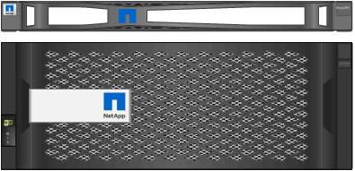
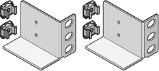
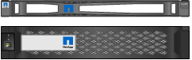

= 箱を開梱します
:allow-uri-read: 
:icons: font
:imagesdir: ../media/

[role="lead"]
StorageGRID アプライアンスを設置する前にすべて開梱し、内容物を納品書の項目と比較します。

== SGF6112アプライアンス

=== ハードウェア

[cols="1a,4a"]
|===
| 項目 | それがどのように見えるか 

 a| 
SGF6112を参照してください
 a| 
image::../media/sg6000_cn_front_without_bezel.gif[SGF6112アプライアンスの前面]

 a| 
レールキットと取扱説明書
 a| 
image::../media/rail_kit.gif[レールキット]

 a| 
前面ベゼル
 a| 
image::../media/sgf_6112_front_bezel.png[前面ベゼル]

|===

=== 電源コード

SGF6112アプライアンスには、出荷時に次の電源コードが付属しています。

TIP: キャビネットによっては、アプライアンスに付属している電源コードではなく特別な電源コードを使用する場合があります。

[cols="1a,4a"]
|===
| 項目 | それがどのように見えるか 

 a| 
お住まいの国に対応した2本の電源コード
 a| 
image::../media/power_cords.gif[電源コード]

|===

== SG6000アプライアンス

=== SG6060ハードウェア

[cols="1a,4a"]
|===
| 項目 | それがどのように見えるか 

 a| 
SG6000-CN コントローラ
 a| 
image::../media/sg6000_cn_front_without_bezel.gif[SG6000-CN コントローラ]

 a| 
E2860コントローラシェルフ（ドライブなし
 a| 
image::../media/de460c_table_size.gif[SG5760 4U アプライアンス]

 a| 
前面ベゼル2個
 a| 

 a| 
レールキット×2（取扱説明書付き）
 a| 
image::../media/rail_kit.gif[レールキット]

 a| 
ドライブ×60（SSD×2、NL-SAS×58）
 a| 
image::../media/sg5760_drive.gif[ドライブ]

 a| 
4つのハンドル
 a| 
image::../media/handles.gif[SG5760 の取っ手]

 a| 
角穴ラック取り付け用の背面ブラケットとケージナット
 a| 

|===

=== SG6060 拡張シェルフ

[cols="1a,4a"]
|===
| 項目 | それがどのように見えるか 

 a| 
拡張シェルフにドライブが取り付けられていません
 a| 
image::../media/de460c_table_size.gif[SG5760 4U アプライアンス]

 a| 
前面ベゼル
 a| 
image::../media/front_bezel_for_table_de460c.gif[前面ベゼル DE460C]

 a| 
NL-SAS ドライブ × 60
 a| 
image::../media/sg5760_drive.gif[ドライブ]

 a| 
レールキット（取扱説明書付き）×1
 a| 
image::../media/rail_kit.gif[レールキット]

 a| 
4つのハンドル
 a| 
image::../media/handles.gif[SG5760 の取っ手]

 a| 
角穴ラック取り付け用の背面ブラケットとケージナット
 a| 

|===

=== SGF6024ハードウェア

[cols="1a,4a"]
|===
| 項目 | それがどのように見えるか 

 a| 
SG6000-CN コントローラ
 a| 
image::../media/sg6000_cn_front_without_bezel.gif[SG6000-CN コントローラ]

 a| 
ソリッドステート（フラッシュ）ドライブを24本搭載したEF570フラッシュアレイ
 a| 
image::../media/de224c_with_drives.gif[EF570 コントローラシェルフ]

 a| 
前面ベゼル2個
 a| 

 a| 
レールキット×2（取扱説明書付き）
 a| 
image::../media/rail_kit.gif[レールキット]

 a| 
シェルフのエンドキャップ
 a| 
image::../media/endcaps.png[エンドキャップ]

|===

=== ケーブルとコネクタ

SG6000アプライアンスには、出荷時に次のケーブルとコネクタが付属しています。

TIP: キャビネットによっては、アプライアンスに付属している電源コードではなく特別な電源コードを使用する場合があります。

[cols="1a,4a"]
|===
| 項目 | それがどのように見えるか 

 a| 
お住まいの国に対応した4本の電源コード
 a| 
image::../media/power_cords.gif[電源コード]

 a| 
光ケーブルとSFPトランシーバ
 a| 
image::../media/fc_cable_and_sfp.gif[光ケーブルと SFP]

* FC インターコネクトポート用の光ケーブル × 4
* 16Gb/s FC 対応の SFP+ トランシーバ × 4

 a| 
オプション：各SG6060拡張シェルフを接続するためのSASケーブル×2
 a| 
image::../media/sas_cable.gif[SAS ケーブル]

|===

== SG5700アプライアンス

=== ハードウェア

[cols="1a,4a"]
|===
| 項目 | それがどのように見えるか 

 a| 
12ドライブ搭載のSG5712アプライアンス
 a| 
image::../media/de212c_table_size.gif[SG5712 2U アプライアンス]

 a| 
SG5760アプライアンス（ドライブなし
 a| 
image::../media/de460c_table_size.gif[SG5760 4U アプライアンス]

 a| 
アプライアンスの前面ベゼル
 a| 
image::../media/sg5700_front_bezels.gif[SG5712 と SG5760 のベゼル]

 a| 
レールキットと取扱説明書
 a| 
image::../media/rail_kit.gif[レールキット]

 a| 
SG5760：60ドライブ
 a| 
image::../media/sg5760_drive.gif[ドライブ]

 a| 
SG5760：ハンドル
 a| 
image::../media/handles.gif[SG5760 の取っ手]

 a| 
SG5760：角穴ラックへの設置用の背面ブラケットとケージナット
 a| 

|===

=== ケーブルとコネクタ

SG5700アプライアンスには、出荷時に次のケーブルとコネクタが付属しています。

TIP: キャビネットによっては、アプライアンスに付属している電源コードではなく特別な電源コードを使用する場合があります。

[cols="1a,4a"]
|===
| 項目 | それがどのように見えるか 

 a| 
お住まいの国に対応した2本の電源コード
 a| 
image::../media/power_cords.gif[電源コード]

 a| 
光ケーブルとSFPトランシーバ
 a| 
image::../media/fc_cable_and_sfp.gif[光ケーブルと SFP]

* FC インターコネクトポート用の光ケーブル × 2
* 4 つの 16Gb/s FC インターコネクトポートおよび 4 つの 10GbE ネットワークポートの両方に対応した、 8 つの SFP+ トランシーバ

|===

== SG100およびSG1000アプライアンス

=== ハードウェア

[cols="1a,4a"]
|===
| 項目 | それがどのように見えるか 

 a| 
SG100またはSG1000
 a| 
image::../media/sg6000_cn_front_without_bezel.gif[前面ドライブ SG 100 または SG1000 サービスアプライアンス]

 a| 
レールキットと取扱説明書
 a| 
image::../media/rail_kit.gif[レールキット]

|===

=== 電源コード

SG100またはSG1000アプライアンスには、次の電源コードが付属しています。

TIP: キャビネットによっては、アプライアンスに付属している電源コードではなく特別な電源コードを使用する場合があります。

[cols="1a,4a"]
|===
| 項目 | それがどのように見えるか 

 a| 
お住まいの国に対応した2本の電源コード
 a| 
image::../media/power_cords.gif[電源コード]

|===