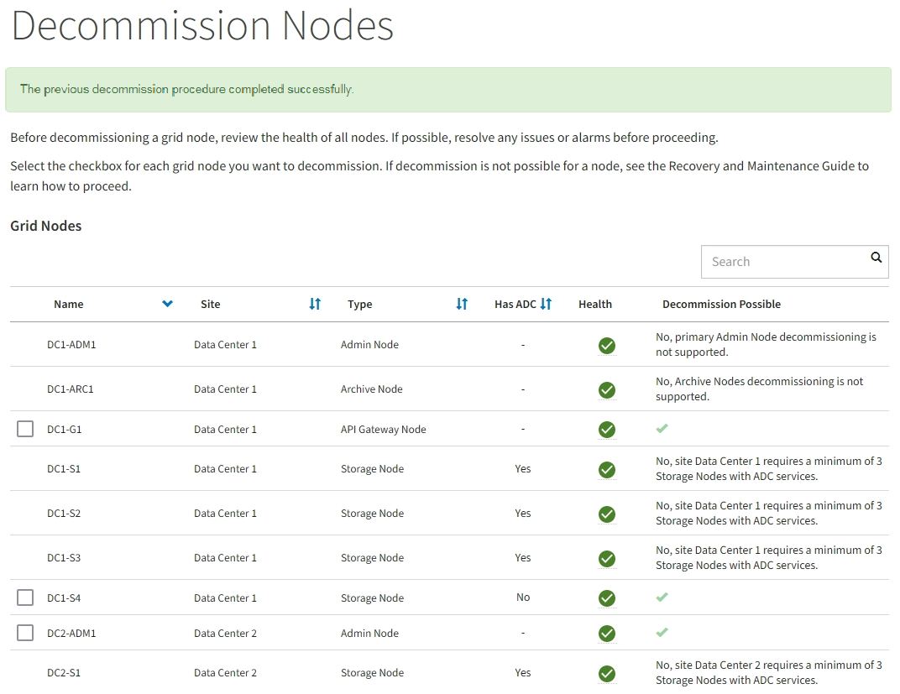

= 接続されているグリッドノードの運用を停止
:allow-uri-read: 
:icons: font
:imagesdir: ../media/

[role="lead"]
グリッドに接続されているノードは、運用停止して完全に削除できます。

.作業を開始する前に
* 要件とを理解しておきます link:considerations-for-decommissioning-grid-nodes.html["グリッドノードの運用停止に関する考慮事項"]。
* 必要な情報やデータ、機器をすべて揃えておきます。
* アクティブなデータ修復ジョブがないことを確認しておきます。
* グリッド内でストレージノードのリカバリが実行中でないことを確認します。停止している場合は、リカバリの一環として実行されたCassandraの再構築が完了するまで待ちます。そのあとで運用停止を続行できます。
* ノード運用停止手順 が一時停止されていないかぎり、ノード手順 の運用停止中に他のメンテナンス手順が実行されないようにしておきます。
* プロビジョニングパスフレーズを用意します。
* Grid ノードが接続されています。
* 運用を停止するノードの*[Decommission Possible]*列に緑のチェックマークが表示されている。
+

NOTE: 1つ以上のボリュームがオフライン（アンマウント済み）の場合、またはオンライン（マウント済み）でエラー状態の場合、運用停止は開始されません。

+

NOTE: 運用停止の実行中に1つ以上のボリュームがオフラインになると、それらのボリュームがオンラインに戻ったあとに運用停止プロセスが完了します。

* すべてのグリッドノードが正常（緑）な状態です image:../media/icon_alert_green_checkmark.png["緑のチェックマークアイコン"]。* Health * 列に次のいずれかのアイコンが表示された場合は、問題 を解決する必要があります。
+
[cols="1a,1a,3a"]
|===
| をクリックします。 | 色（ Color ） | 重大度 

 a| 
image:../media/icon_alarm_yellow_notice.gif["黄色の四角形のアイコン"]
 a| 
黄色
 a| 
注意

 a| 
image:../media/icon_alert_yellow_minor.png["薄いオレンジの菱形のアイコン"]
 a| 
薄いオレンジ
 a| 
マイナー

 a| 
image:../media/icon_alert_orange_major.png["濃いオレンジの菱形のアイコン"]
 a| 
濃いオレンジ
 a| 
メジャー（ Major ）

 a| 
image:../media/icon_alert_red_critical.png["赤の x 印のアイコン"]
 a| 
赤
 a| 
重要

|===
* 以前に切断されているストレージノードの運用を停止した場合は、データ修復ジョブがすべて正常に完了している。を参照してください link:checking-data-repair-jobs.html["データ修復ジョブを確認します"]。

IMPORTANT: この手順 で指示されるまでは、グリッドノードの仮想マシンやその他のリソースを削除しないでください。

.手順
. [Decommission Nodes]ページで、運用を停止する各グリッドノードのチェックボックスを選択します。
. プロビジョニングパスフレーズを入力します。
+
[ * 分解を開始 * （ Start Decommission * ） ] ボタンが有効になります。

. * 分解を開始 * をクリックします。
. 確認ダイアログでノードのリストを確認し、*[OK]*をクリックします。
+
ノードの運用停止手順 が開始され、各ノードの進捗状況が表示されます。手順 の実行中、グリッド設定の変更を反映するために新しいリカバリパッケージが生成されます。

+
image::../media/decommission_nodes_procedure_in_progress.png[実行中のノードの運用停止のスクリーンショット]

+

IMPORTANT: 運用停止手順 の開始後にストレージノードをオフラインにしないでください。状態を変更すると、一部のコンテンツが他の場所にコピーされなくなる可能性があります。

. 新しいリカバリパッケージが利用可能になったら、リンクをクリックするか、 * maintenance * > * System * > * Recovery パッケージ * を選択して、リカバリパッケージのページにアクセスします。次に、をダウンロードします `.zip` ファイル。
+
の手順を参照してください link:downloading-recovery-package.html["リカバリパッケージをダウンロードしています"]。

+

NOTE: 手順 の運用停止中に問題が発生した場合にグリッドをリカバリできるよう、できるだけ早くリカバリパッケージをダウンロードしてください。

. Decommission Nodes ページを定期的に監視して、選択したすべてのノードの運用が正常に停止されることを確認します。
+
ストレージノードの運用停止には、数日から数週間かかることがあります。すべてのタスクが完了すると、成功メッセージとともにノード選択リストが再表示されます。

+

. プラットフォームに応じた手順に従います。例：
+
** * Linux * ：インストール中に作成したノード構成ファイルを削除してボリュームの接続を解除できます。
** *vmware*: vCenter の「 Delete from Disk 」オプションを使用して、仮想マシンを削除できます。また、仮想マシンに依存しないデータディスクを削除しなければならない場合もあります。
** * StorageGRID アプライアンス * ：アプライアンスノードは自動的に導入されていない状態に戻り、 StorageGRID アプライアンスインストーラにアクセスできます。アプライアンスの電源をオフにするか、別の StorageGRID システムに追加できます。

ノードの運用停止手順 が完了したら、次の手順を実行します。

* 運用停止したグリッドノードのドライブを確実に消去します。市販のデータ消去ツールまたはデータ消去サービスを使用して、ドライブからデータを完全かつ安全に削除します。
* アプライアンスノードの運用を停止し、アプライアンス上のデータがノード暗号化を使用して保護されている場合は、StorageGRID アプライアンスインストーラを使用してキー管理サーバ設定をクリアします（Clear KMS）。アプライアンスを別のグリッドに追加する場合は、KMSの設定をクリアする必要があります。手順については、を参照してください link:../commonhardware/monitoring-node-encryption-in-maintenance-mode.html["メンテナンスモードでノード暗号化を監視します"]。

.関連情報
link:../rhel/index.html["Red Hat Enterprise Linux または CentOS をインストールします"]
