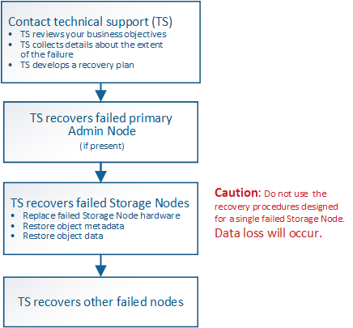

= テクニカルサポートによるサイトリカバリの実行方法
:allow-uri-read: 
:icons: font
:imagesdir: ../media/

[role="lead"]
StorageGRID サイト全体に障害が発生した場合、または複数のストレージノードで障害が発生した場合は、テクニカルサポートにお問い合わせください。テクニカルサポートは、お客様の状況を評価し、リカバリプランを作成してから、障害が発生したノードまたはサイトをビジネス目標に沿った方法でリカバリし、リカバリ時間を最適化して、不要なデータ損失を防ぎます。

CAUTION: サイトリカバリは、テクニカルサポートのみが実行できます。

StorageGRID システムは、さまざまな障害に対する耐障害性を備えており、多くのリカバリ手順やメンテナンス手順を自分で実行できます。ただし、一般化された単純なサイトリカバリ手順 は作成が困難です。詳細な手順は、状況に固有の要因によって異なるためです。例：

* * あなたのビジネス目標 *: StorageGRID の場所の完全な損失の後、あなたのビジネス目的を満たす最もよい方法を評価するべきである。たとえば、失われたサイトをインプレースで再構築しますか？失われた StorageGRID サイトを新しい場所に交換しますか？お客様の状況はそれぞれ異なり、優先事項に対応するようにリカバリプランを設計する必要があります。
* *障害の正確な内容*：サイトリカバリを開始する前に、障害が発生したサイトに損傷がないノードがないか、リカバリ可能なオブジェクトが含まれているストレージノードがないかを確認します。有効なデータが含まれているノードまたはストレージボリュームを再構築すると、不要なデータ損失が発生する可能性があります。
* * アクティブな ILM ポリシー * ：グリッド内のオブジェクトコピーの数、タイプ、および場所は、アクティブな ILM ポリシーによって制御されます。ILM ポリシーの詳細は、リカバリ可能なデータの量、およびリカバリに必要な特定の手法に影響する可能性があります。
+

CAUTION: サイトにオブジェクトの唯一のコピーが含まれていてサイトが失われると、そのオブジェクトは失われます。

* * バケット（またはコンテナ）の整合性 * ：バケット（またはコンテナ）に適用される整合性レベルは、 StorageGRID がオブジェクトの取り込みが成功したことをクライアントに通知する前に、すべてのノードとサイトにオブジェクトメタデータを完全にレプリケートするかどうかに影響します。整合性レベルで結果整合性を確保できる場合は、サイト障害時に一部のオブジェクトメタデータが失われている可能性があります。リカバリ可能なデータの量や、リカバリ手順 の詳細に影響する可能性があります。
* * 最新の変更履歴 * ：リカバリ手順 の詳細は、障害発生時のメンテナンス手順の進行状況や、 ILM ポリシーに最近変更が加えられたかどうかによって影響を受ける可能性があります。テクニカルサポートは、サイトのリカバリを開始する前に、グリッドの最新の履歴と現在の状況を評価する必要があります。

== サイトリカバリの概要

これは、障害が発生したサイトのリカバリでテクニカルサポートが使用するプロセスの概要です。

CAUTION: サイトリカバリは、テクニカルサポートのみが実行できます。

. テクニカルサポートにお問い合わせください。
+
テクニカルサポートは、障害に関する詳細な評価を行い、パートナー様と協力してビジネス目標を確認します。この情報に基づいて、テクニカルサポートはお客様の状況に合わせたリカバリプランを作成します。

. テクニカルサポートは、障害が発生したプライマリ管理ノードをリカバリします。
. テクニカルサポートは、以下の概要に従って、すべてのストレージノードをリカバリします。
+
.. 必要に応じて、ストレージノードのハードウェアまたは仮想マシンを交換します。
.. 障害が発生したサイトにオブジェクトメタデータをリストアする。
.. リカバリしたストレージノードにオブジェクトデータをリストアします。
+

CAUTION: 単一の障害ストレージノードのリカバリ手順を使用すると、データが失われます。

+

NOTE: サイト全体で障害が発生した場合、オブジェクトとオブジェクトメタデータを正常にリストアするには特別なコマンドが必要になります。

. テクニカルサポートは障害が発生した他のノードをリカバリします
+
オブジェクトメタデータとデータのリカバリが完了したら、障害が発生したゲートウェイノード、非プライマリ管理ノード、またはアーカイブノードを標準の手順でリカバリできます。

.関連情報
link:site-decommissioning.html["サイトの運用停止"]
