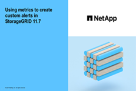

= アラートの管理：概要
:allow-uri-read: 
:icons: font
:imagesdir: ../media/

[role="lead"]
アラートシステムでは、 StorageGRID の運用中に発生する問題を、使いやすいインターフェイスを通じて検出し、評価し、解決することができます。

カスタムアラートの作成、アラートの編集または無効化、アラート通知の管理を行うことができます。

詳細については、以下をご覧ください。

* ビデオを確認します。 https://["ビデオ：StorageGRID 11.7のアラートの概要"^]
+
[link=https://netapp.hosted.panopto.com/Panopto/Pages/Viewer.aspx?id=18df5a3d-bf19-4a9e-8922-afbd009b141b]
image::../media/video-screenshot-alert-overview-117.png[ビデオ：StorageGRID 11.7のアラートの概要]

* ビデオを確認します。 https://["ビデオ：StorageGRID 11.7で指標を使用してカスタムアラートを作成する"^]
+
[link=https://netapp.hosted.panopto.com/Panopto/Pages/Viewer.aspx?id=61acb7ba-7683-488a-a689-afb7010088f3]

* を参照してください link:alerts-reference.html["アラート一覧"]。

