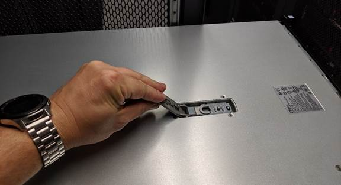

= SGF6112カバーを交換してください
:allow-uri-read: 
:icons: font
:imagesdir: ../media/

[role="lead"]
メンテナンスのためにアプライアンスのカバーを取り外して内部コンポーネントにアクセスし、作業が完了したらカバーを元に戻します。

== カバーを取り外します

.作業を開始する前に
上部カバーに手が届くように、キャビネットまたはラックからアプライアンスを取り外します。

link:reinstalling-sgf6112-into-cabinet-or-rack.html["SGF6112をキャビネットまたはラックから取り外します"]

.手順
. SGF6112のカバーラッチがロックされていないことを確認します。必要に応じて、ラッチロックに表示されているように、プラスチック製ラッチロックの青色の 4 分の 1 回転をアンロック方向に回します。
. ラッチをSGF6112シャーシの背面方向に上下に回転させて停止し、カバーをシャーシから慎重に持ち上げて脇に置きます。
+

+

IMPORTANT: 静電気防止用リストバンドのストラップの端を手首に巻き付け、SGF6112内部での作業時に静電気が発生しないようにクリップの端を金属製のアースに固定します。

== カバーを再度取り付けます

.作業を開始する前に
アプライアンス内ですべてのメンテナンス手順を完了しておきます。

.手順
. カバーラッチを開いた状態で、シャーシの上にあるカバーを持ち、上部カバーラッチの穴をシャーシのピンに合わせます。カバーの位置が合ったら、シャーシに下ろします。
+
image::../media/sg6060_cover_latch_alignment_pin.jpg[SG6060 のカバーラッチアライメントピン]

. カバーラッチが止まるまで前後に回し、カバーをシャーシに完全に固定します。カバーの前端に隙間がないことを確認します。
+
カバーが完全に装着されていないと、SGF6112をラックにスライドできない場合があります。

. オプション：ラッチロックに表示されているように、青色のプラスチックラッチロックを 1 / 4 回転させてロック方向に回します。

.完了後
キャビネットまたはラックにアプライアンスを再度取り付けます。

link:reinstalling-sgf6112-into-cabinet-or-rack.html["SGF6112をキャビネットまたはラックに再度取り付けます"]
