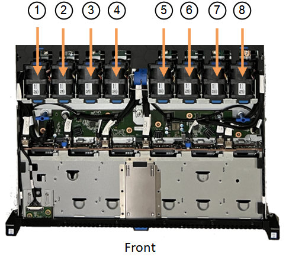

= SGF6112アプライアンスのファンを交換します
:allow-uri-read: 
:icons: font
:imagesdir: ../media/

[role="lead"]
SGF6112アプライアンスには、8つの冷却ファンがあります。いずれかのファンで障害が発生した場合は、アプライアンスの冷却が適切に行われるように、できるだけ早く交換する必要があります。

.作業を開始する前に
* 正しい交換用ファンを用意しておきます。
* 交換するファンの場所を確認しておきます。
+
link:verify-component-to-replace.html["交換するコンポーネントを確認します"]

* データセンターのファンを交換するSGF6112アプライアンスの物理的な場所を確認しておきます。
+
link:locating-sgf6112-in-data-center.html["データセンターにアプライアンスを配置します"]

+

NOTE: A link:shut-down-sgf6112.html["アプライアンスの通常のシャットダウン"] は、アプライアンスをラックから取り外す前に必要です。

* すべてのケーブルを外し、アプライアンスのカバーを取り外しておきます。
+
link:reinstalling-sgf6112-cover.html["SGF6112カバーを取り外します"]

* 他のファンが取り付けられ、動作していることを確認しておきます。

.このタスクについて
サービスの中断を防ぐには、ファンの交換を開始する前に他のすべてのストレージノードがグリッドに接続されていることを確認するか、スケジュールされたメンテナンス時間中にサービスが通常停止する可能性がある時間帯にファンを交換してください。の情報を参照してください link:../monitor/monitoring-system-health.html#monitor-node-connection-states["ノードの接続状態を監視しています"]。

IMPORTANT: オブジェクトのコピーを1つだけ作成するILMルールを使用したことがある場合は、スケジュールされたメンテナンス時間にファンを交換する必要があります。そうしないと、この手順 中にオブジェクトへのアクセスが一時的に失われる可能性があります。については、を参照してください link:../ilm/why-you-should-not-use-single-copy-replication.html["シングルコピーレプリケーションを使用しない理由"]。

ファンの交換中は、アプライアンスノードにアクセスできなくなります。

次の図は、アプライアンスのファンを示しています。コネクタが強調表示されます。アプライアンスの上部カバーを取り外すと、冷却ファンがあります。

NOTE: 2 つの電源装置にもそれぞれファンが搭載されています。電源装置ファンは、この手順 には含まれていません。

image::../media/sgf6112_fan_fru.png[SGF6112 FRUのファン]

.手順
. ESD リストバンドのストラップの端を手首に巻き付け、静電気の放電を防ぐためにクリップの端をメタルアースに固定します。
. 交換が必要なファンの場所を確認します。
+
8つのファンはシャーシ内で次の位置にあります（上部カバーを取り外したSGF6112の前面半分）。

+

|===

|  | ファンユニット 

 a| 
1.
 a| 
FAN_SYS0

 a| 
2.
 a| 
FAN_SYS1

 a| 
3.
 a| 
FAN_SYS2

 a| 
4.
 a| 
FAN_SYS3の略

 a| 
5.
 a| 
FAN_SYS4

 a| 
6.
 a| 
FAN_SYS5

 a| 
7.
 a| 
FAN_SYS6

 a| 
8.
 a| 
FAN_SYS7

|===
. ファンの青いタブを使用して、障害が発生したファンをシャーシから持ち上げます。
+
image::../media/fan_removal.png[ファンの取り外し]

. 交換用ファンをシャーシのオープンスロットにスライドさせて挿入します。
+
ファンのコネクタを回路基板のソケットに合わせてください。

. ファンのコネクタを回路基板にしっかりと押し込みます（ソケットがハイライトされています）。
+
image::../media/sgf6112_fan_socket_check.png[ファンコネクタの点検]

. 上部カバーをアプライアンスに戻し、ラッチを押し下げてカバーを所定の位置に固定します。
. アプライアンスの電源を入れ、アプライアンスの LED とブート時のコードを監視します。
+
BMC インターフェイスを使用して、ブート時のステータスを監視します。

. アプライアンスノードが Grid Manager に表示され、アラートが表示されていないことを確認します。

部品の交換後、障害のある部品は、キットに付属する RMA 指示書に従ってネットアップに返却してください。を参照してください https://mysupport.netapp.com/site/info/rma["パーツの返品と交換"^] 詳細については、を参照してください。
